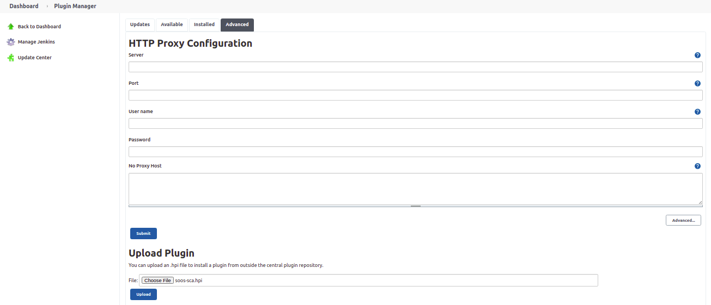

# SOOS SCA Plugin

SOOS is the affordable, easy-to-integrate Software Composition Analysis solution for your whole team.

## Features
- Scan your Open Source Software, Webapps and Containers for vulnerabilities
- Ease of integration (run your first scan in minutes or get your first scan results within minutes)
- Control the introduction of new dependencies and vulnerabilities
- Exclude unwanted license-types
- Detect and prevent dependency substitutions and typo-squatting
- Generate SBOMs
- Fill out your compliance worksheets with confidence
- Simple and affordable pricing. Only one plan that includes every feature we offer up to 100 projects, unlimited users, and no scan limits.

## How to Use

The **SOOS SCA Plugin** will locate and analyze any supported manifest files under the specified directory.

To use SOOS SCA Plugin you need to:

1. [Install the SOOS SCA Plugin](#install-the-soos-sca-plugin)
2. [Configure authorization](#configure-authorization)
3. [Select the mode](#select-the-mode)
4. [Configure other plugin parameters](#configure-other-plugin-parameters)

## Supported Languages and Package Managers

* Cargo - Rust
* Composer - PHP
* Dart PM (Pub Package Manager) - Dart
* Gradle - Java & Kotlin
* Homebrew - (various languages)
* Maven - Java
* Mix - Elixir
* NuGet - .NET
* NPM (Node Package Manager) - Node 
* PyPI - Python 
* Rebar3 - Erlang
* Ruby Gems - Ruby

Our full list of supported manifest formats can be found [here](https://kb.soos.io/help/soos-languages-supported).

## Need an Account?
**Visit [soos.io](https://app.soos.io/register) to create your trial account.**

## Setup

### Install the SOOS SCA Plugin

Install or upgrade the SOOS SCA Plugin from Jenkins Plugin Manager with these steps. Once complete, you’re all set to add a SOOS SCA step to your projects.

Log in to your Jenkins instance to install the SOOS SCA Plugin. Navigate to **Manage Jenkins > Manage Plugins** and select **Available** tab. Search for **SOOS SCA** and from list, check the radio button to install the plugin for your Jenkins installation. After that just need to click the install button.

<blockquote style="margin-bottom: 10px;">

 Show example 

</blockquote>

To manually install the plugin you have two options:

1.  Download and copy the plugin .hpi file into <jenkins-home>/plugins/, and restart the server.
2.  Download the .hpi file, log in to your Jenkins instance, go to **Manage Jenkins > Manage Plugins** and select **Advanced** tab. Just choose the **soos-sca.hpi** file, and click the Upload button to install it.

<blockquote style="margin-bottom: 10px;">

 Show example 

</blockquote>

### Configure authorization

**SOOS SCA** needs environment variables which are passed as parameters. These environment variables are stored by checking "Environment variables" on **Manage Jenkins > Configure System > Global Properties**, and they are required for the plugin to operate.

| Property | Description |
| --- | --- |
| SOOS_CLIENT_ID | Provided to you when subscribing to SOOS services. |
| SOOS_API_KEY | Provided to you when subscribing to SOOS services. |

These values can be found in the SOOS App under Integrate.

### Select the mode

#### Run and wait for the analysis report
Set the **Mode** parameter to *Run and wait*, then you can run the plans in your CI/CD, and wait for the scan to complete.

#### Start the Scan
Set the **Mode** parameter to *Async init*, if you don't care about the scan result in your CI/CD plan, this is all you have to do!

#### Wait for the Scan
If you care about the result or want to break the build when issues occur, set the **Mode** parameter to *Async result*.

### Configure other plugin parameters

<blockquote style="margin-bottom: 10px;">

 Show parameters 

| Select/Inputs                    | Default | Description                                                                                                                                                                                                                                   |
|----------------------------------| --- |-----------------------------------------------------------------------------------------------------------------------------------------------------------------------------------------------------------------------------------------------|
| Project Name                     | ""  | REQUIRED. A custom project name that will present itself as a collection of test results within your soos.io dashboard.                                                                                                                       |
| Mode                             | "Run and wait"  | Running mode, alternatives: "Async init" - "Async result"                                                                                                                                                                                     |
| Directories To Exclude           | ""  | List (comma separated) of directories (relative to ./) to exclude from the search for manifest files. Example - Correct: bin/start/ ... Example - Incorrect: ./bin/start/ ... Example - Incorrect: /bin/start/'                               |
| Files To Exclude                 | ""  | List (comma separated) of files (relative to ./) to exclude from the search for manifest files. Example - Correct: bin/start/manifest.txt ... Example - Incorrect: ./bin/start/manifest.txt ... Example - Incorrect: /bin/start/manifest.txt' |
| On Failure                       | "Fail the build"  | Stop the building in case of failure, alternative: "Continue on failure"                                                                                                                                                                      |
| Analysis Result Max Wait         | 300  | Maximum seconds to wait for Analysis Result before exiting with error.                                                                                                                                                                        |
| Analysis Result Polling Interval | 10  | Polling interval (in seconds) for analysis result completion (success/failure.). Min 10.                                                                                                                                                      |
| API Base URL                     | "https://api.soos.io/api/"  | The API BASE URI provided to you when subscribing to SOOS services.                                                                                                                                                                           |
| Package Manager                  | ""  | Comma separated list of names of Package Managers to filter manifest search.                                                                                                                                                                  |

</blockquote>

## Feedback and Support
### Knowledge Base
[Go To Knowledge Base](https://kb.soos.io/help)

